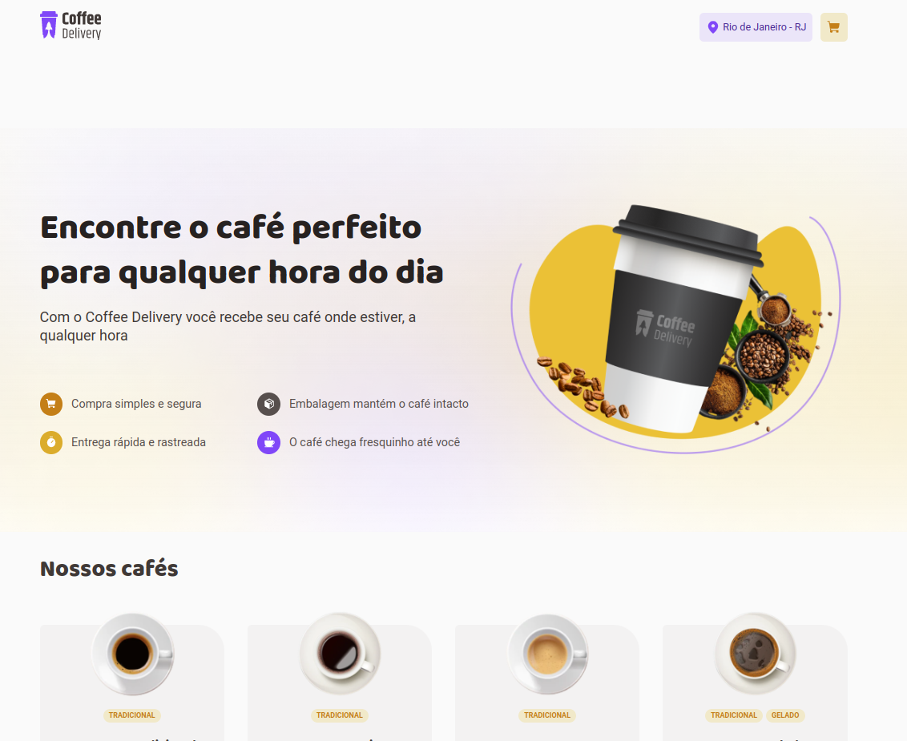

# Coffee Delivery

  

### O projeto

A aplicação Coffee Delivery é o 2° Desafio do Ignite da Rocketseat. Esse é um projeto onde simulamos um e-commerce de vendas de café.

O objeto do projeto foi colocar em prática alguns conceitos aprendidos durante o capitulo do curso.

[Acesse o projeto clicando aqui](https://coffee-delivery-thilourenco.vercel.app/)

### Tecnologias 

- [React](https://pt-br.reactjs.org/)
- [TypeScript](https://www.typescriptlang.org/)
- [React-router-dom](https://reactrouter.com/en/main)
- [Styled-components](https://styled-components.com/)
- [React-hook-form](https://react-hook-form.com/)
- [Zod](https://zod.dev/) 
- [Axios](https://axios-http.com/ptbr/docs/intro)
- [React-toastify](https://fkhadra.github.io/react-toastify/introduction)

## :memo: License

Esse projeto está sob a licença MIT. Veja o arquivo [LICENSE](LICENSE) para mais detalhes.

Criado por [Thiago Lourenço](https://github.com/ThiLourenco).